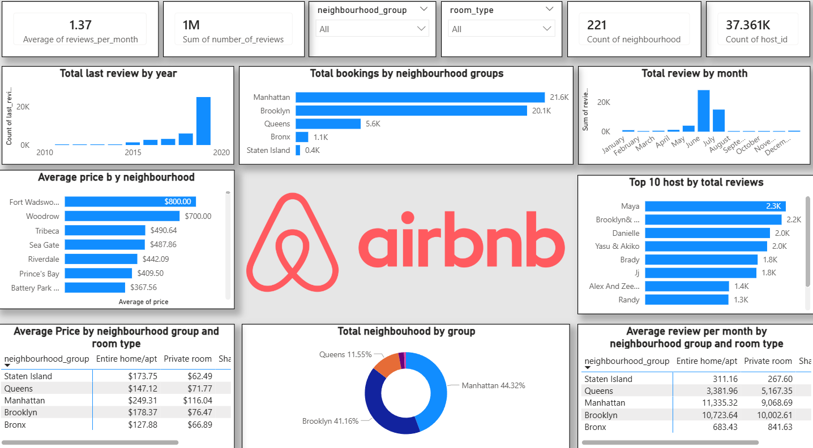

# 🏠 Airbnb NYC 2019 — EDA & K-Means Clustering

An end-to-end exploratory data analysis and unsupervised machine learning project on the **New York City Airbnb Open Data (2019)** dataset. The project uncovers pricing patterns, borough-level trends, and property segments using K-Means clustering.

---

## 📊 Dashboard Preview



> Power BI dashboard summarising key metrics: 1M+ total reviews, 37K+ hosts, average pricing by neighbourhood, top hosts, and seasonal booking trends.

---

## 📁 Dataset

- **Source:** [AB_NYC_2019.csv](https://www.kaggle.com/datasets/dgomonov/new-york-city-airbnb-open-data)
- **Records:** ~49,000 listings
- **Features:** 16 columns including `neighbourhood_group`, `room_type`, `price`, `availability_365`, `number_of_reviews`, latitude/longitude, and more.

---

## 🔍 Project Overview

### 1. Data Cleaning
- Filled missing `name` and `host_name` values with `"Unknown"`
- Imputed missing `reviews_per_month` with `0`
- Removed price outliers (`price >= $1,000`) before modelling

### 2. Exploratory Data Analysis (EDA)

| Analysis | Key Finding |
|---|---|
| Room Type Distribution | Entire home/apt dominates listings |
| Average Price by Borough | Manhattan is the most expensive; Bronx the cheapest |
| Listings by Borough | Manhattan (44%) and Brooklyn (41%) lead |
| Price Distribution | Right-skewed; most listings under $200/night |
| Availability | Bimodal — many listings nearly always or never available |
| Top Hosts | Maya leads with 2.3K reviews |
| Correlation Heatmap | `reviews_per_month` correlates with `number_of_reviews` |
| Geographic Scatter | Clear spatial clustering by borough |

### 3. Feature Engineering
- Created `price_category` buckets: **Low** ($0–100), **Medium** ($101–300), **High** ($301–1000)

### 4. K-Means Clustering

Features used: `latitude`, `longitude`, `price`, `availability_365`, `minimum_nights`, `room_type_encoded`

Optimal **k = 4** chosen via the Elbow Method (WCSS plot).

| Cluster | Interpretation |
|---|---|
| 0 | Luxury Manhattan homes |
| 1 | Budget Brooklyn rooms |
| 2 | Shared tourist rooms |
| 3 | Long-term affordable stays |

---

## 🛠️ Tech Stack

| Tool | Purpose |
|---|---|
| `pandas` / `numpy` | Data manipulation |
| `matplotlib` / `seaborn` | Visualisation |
| `scikit-learn` | Label encoding, scaling, K-Means |
| Power BI | Interactive dashboard |

---

## 🚀 Getting Started

```bash
# 1. Clone the repo
git clone https://github.com/your-username/airbnb-nyc-analysis.git
cd airbnb-nyc-analysis

# 2. Install dependencies
pip install pandas numpy matplotlib seaborn scikit-learn

# 3. Add the dataset
# Download AB_NYC_2019.csv from Kaggle and place it in the project root

# 4. Run the notebook
jupyter notebook project_2.ipynb
```

---

## 📂 Repository Structure

```
airbnb-nyc-analysis/
├── project_2.ipynb     # Main analysis notebook
├── airbnb.png          # Dashboard screenshot
├── AB_NYC_2019.csv     # Dataset (not tracked by git)
└── README.md
```

---

## 📌 Key Takeaways

- **Manhattan** commands the highest average nightly prices but Brooklyn has comparable listing volume.
- **Entire home/apt** listings are pricier on average; shared rooms cluster into budget-travel segments.
- K-Means effectively separates luxury, budget, tourist, and long-stay property types purely from price, location, and availability signals.
